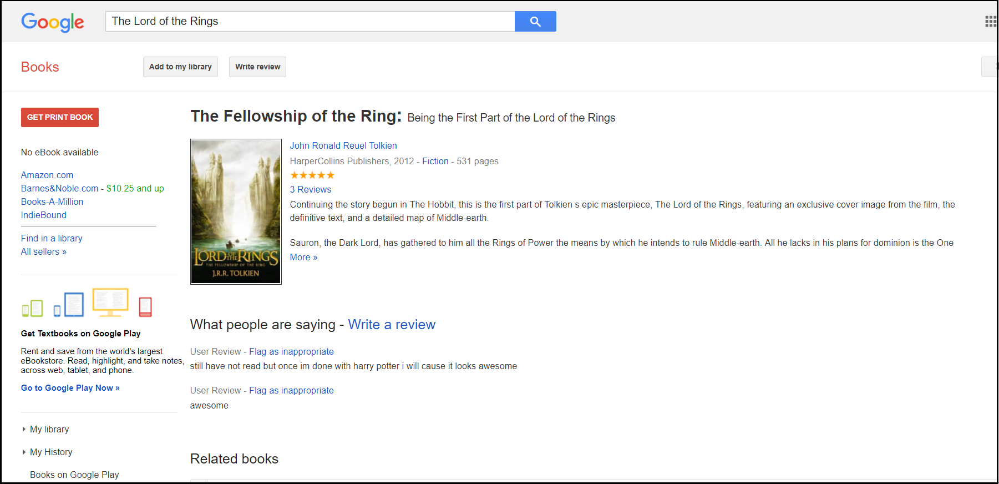
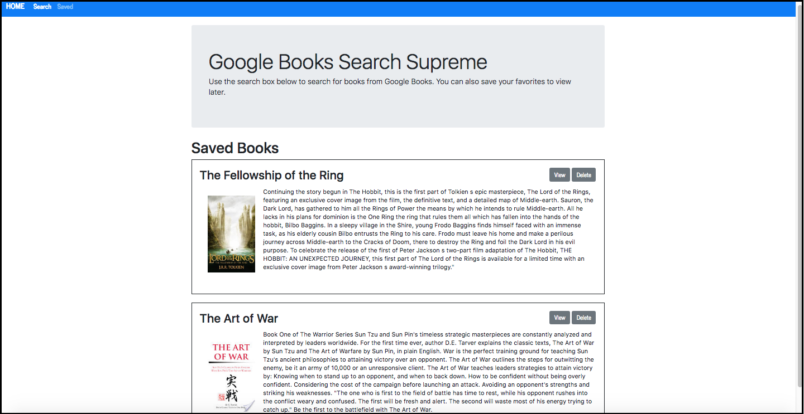

This project was bootstrapped with [Create React App](https://github.com/facebook/create-react-app).

# Google Books Search Supreme
This site allows users to search for books from the Google Books API and save their favorites. This site is great for book-lovers who want to search for information on books and save that information in a single, easily-accessible place.

## How to run the site on a local machine
The repository can be cloned by clicking the Clone or Download button on the main repository page, then clicking the button next to the url which appears below. Then open a Terminal or Git Bash window, navigate to the location where you want to place the cloned repository, then type 'git clone' and then paste the repository that was just copied. The neccessary node packages can installed by navigating into the main directory in the terminal and entering 'npm install.' Then enter 'npm start' to launch the site. The site should then open in the default web browser at 'localhost:3000.'

## Repository Organization
In the main directory, the client folder contains the code for the front-end of the site, whereas the other folders and the 'server.js' file in the main directory contains the code for the back-end. 'server.js' contains code for creating and connecting to the MongoDB database on the local machine or to the MLab database on the deployed site. It also contains code for setting the api routes and for listening to the correct port. Also in the main directory, the 'models' folder contains files with code for creating the 'Book' model in the MongoDB database. In the 'controllers' folder, the 'booksController.js' file imports the 'Books' model and creates code for retrieving information from the database, creating, updating, and removing docuements in the 'Books' model. The 'routes' folder imports the 'controller' code and contains code for setting up the 'get', 'post', 'put', and 'delete' routes, as well as determining which of the 'booksController' methods are utilized when certain routes are hit. 
Within the 'client' folder, there are two subfolders - 'public' and 'src.' Located within the 'public' folder is 'index.html', which contains the html for the site, inclding a div with an id of 'root', which is where the react components are rendered when the application starts. 
The 'src' folder contains the remaining code for creating the front-end of the site. The 'utils' folder contains 'API.js', which has code to allow the front-end of the application to access the api routes set up in the 'routes' folder in the main directory.  
The 'components' folder contains three subfolders, 'Favorites', 'Navbar', and 'Results.' Each of these contains two files - index.js, which contains the JSX code for displaying each component, and a style.css, which styles that component. The 'Navbar' component contains code for displaying the navbar which appears at the top of both pages, as well as links to the 'Saved' and 'Search' pages. The 'Results' component contains code determining how each of the results on the 'Search' page are displayed, including the 'View' button which takes the user to an external Google Books page with more information on the book. The 'Favorites' component contains code for determining how the books on the 'Saved' page are displayed, including a 'Views' button, which like the 'Views' button on the search results contains a link to an external Google Books page for that particular book, and a 'Delete' button to delete that book from the database and from the 'Saved' page.  
Also with the 'src' folder is the 'pages' folder, which contains two subfolder - 'Search' and 'Saved'. Each of these folders contains an index.js file, with JSX code for each of the two pages on the site - the homepage/'Search' page and the 'Saved' page. The 'Search' page imports the 'Results' component, as well as the connection to the api routes found in the API.js file within the 'utils' folder. It also contains methods for querying the Google Books API, as well as saving and the query term and the results in its state. The 'Search' component also contains a method for saving books to the database when the 'Save' button is clicked and is passed as a prop of the 'Results' component. The 'Search' page imports the 'Favorites' component as well as the connection to the api routes found in the API.js file within the 'utils' folder. When this page loads, the saved books data is retrieved from the database and displayed on the page. The 'Search' component also contains a method for deleting books from the database, and passes this method to the 'Favorites' component as a prop. 
Within the 'src' folder is App.js, in which the the 'Navbar' component, and the 'Search' and 'Saved' components are imported. React Router is used to determine when the 'Search' and 'Saved' components are displayed, based on when the url for each of these pages is hit. The 'Navbar' component is displayed on both pages. Also with the 'src' folder is 'index.js', which contains code to render the contents of App.js, and the components within it, to the 'root' div inside of 'index.html' in the 'public' folder.  

## How to use the site
The user can use the navbar at the top of the homepage to navigate to the different pages on the site. Clicking on 'Search' will bring the user to the homepage/'Search' page. Clicking on 'Saved' will direct the user to the 'Saved page. On the homepage, users can search the Google Books API by typing the title of a book in the search bar and clicking the 'Submit' button. Ten results from the API are then displayed below. Within the box for each result, clicking on the 'View' button will open an external Google Books webpage with more information on the book. Clicking the 'Save' button will save the book to the database. The 'Saved' page shows the books the user has saved to the database. The user can once again click on the 'View' button within the div for each book to open a Google Books webpage on the book in another tab, or click the 'Delete' button to delete that book from the database and display the updated results on the page.  

  

  

## Technology used
* HTML
* CSS
* CSS Bootstrap
* JavaScript
* React
* JSX
* Nodejs
* node packages
   * axios
   * react
   * react-dom
   * express
   * mongoose
  
## Link to deployed site
<a href="https://google-books-supreme.herokuapp.com/">Google Books Search Supreme</a>

